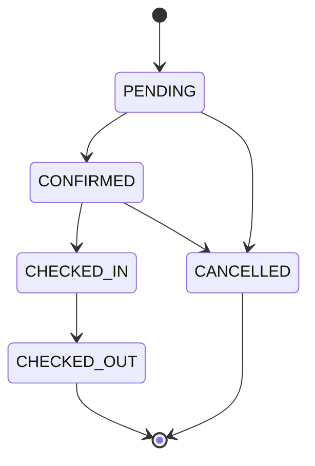
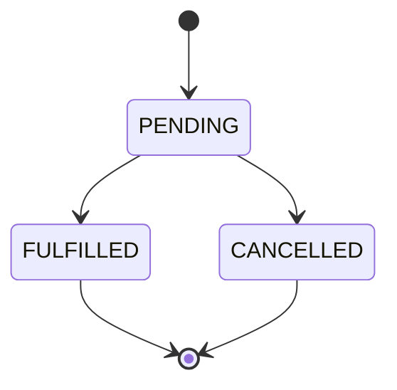
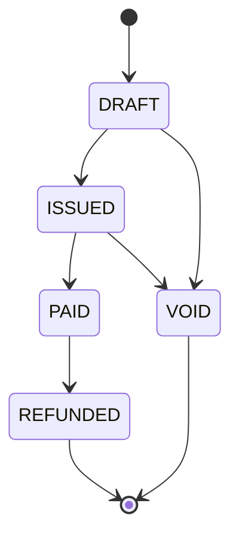
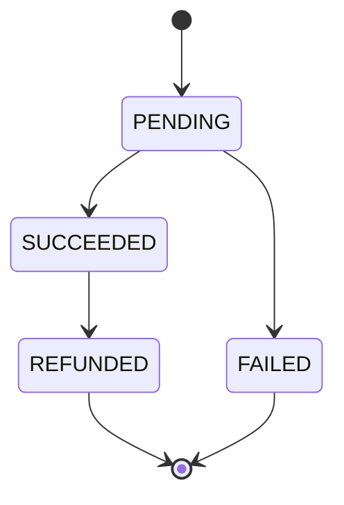
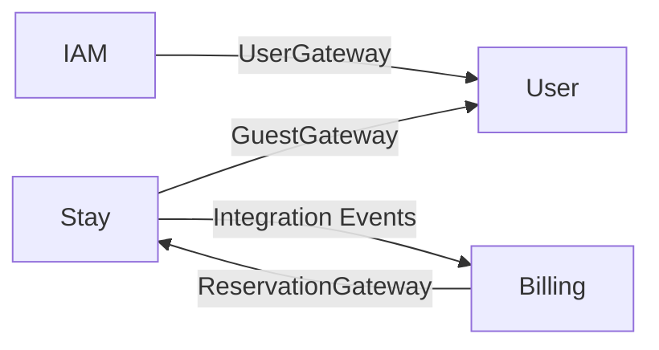
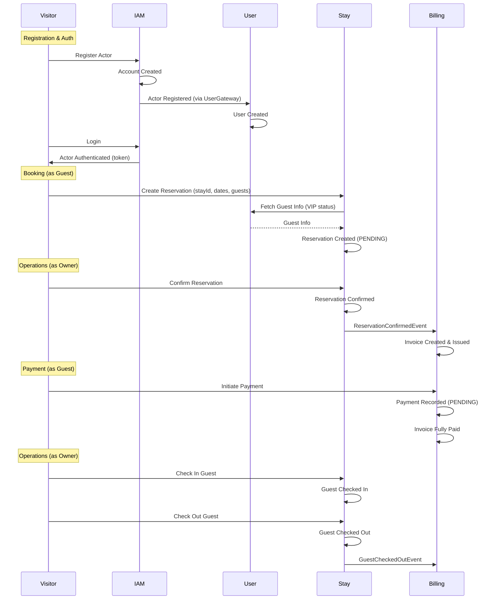

# Event Storming — GuestHub

> Color map based on Event Storming notation.
>
> Reference: [Remote Event Storming Workshop — DDD Practitioners](https://ddd-practitioners.com/2023/03/20/remote-eventstorming-workshop/)

| Color | Element | Role |
|-------|---------|------|
| 🟧 Orange | **Event** | Something that happened in the domain (past tense) |
| 🟦 Blue | **Command** | Intent to cause an event |
| 🟨 Yellow | **Actor** | Who triggers the command |
| 🟪 Purple | **Policy** | Reactive rule ("whenever X, then Y") |
| 🟩 Green | **Read Model** | Data projection for decision-making |
| 🟥 Red | **Test** | Acceptance criteria |
| ⬜ Gray | **Question** | Doubts or uncertainties |
| ◼️ Dark | **Invariant** | Rules that can never be violated |

---

## Bounded Context: IAM (Identity & Access Management)

### Flow: Actor Registration (Guest Self-Registration)

🟨 **Actor:** Visitor (anonymous user)

🟩 **Read Model:** Registration form (name, email, password, phone, document)

🟦 **Command:** Register Actor
> `accountName, name, email, password, phone, document`

◼️ **Invariant:** Email must be unique across the system
◼️ **Invariant:** Document must be unique across the system
◼️ **Invariant:** Password must be valid (hashed via bcrypt)

🟧 **Event:** Account Created
> `accountId, name`

🟧 **Event:** Actor Registered
> `actorId, accountId, email, type=GUEST`

🟪 **Policy:** Whenever Actor Registered (type=GUEST), then Create User
> Integration via UserGateway

🟧 **Event:** User Created
> `userId, email, loyaltyTier=BRONZE`

🟪 **Policy:** Whenever User Created, then Link Actor to User
> `Actor.userId = user.id`

---

### Flow: Hotel Owner Registration

🟨 **Actor:** Visitor (anonymous user)

🟩 **Read Model:** Owner registration form (name, email, password, phone, document)

🟦 **Command:** Register Hotel Owner
> `name, email, password, phone, document`

◼️ **Invariant:** Email must be unique across the system

🟧 **Event:** Account Created
> `accountId, name`

🟧 **Event:** Actor Registered
> `actorId, accountId, email, type=OWNER`

🟪 **Policy:** Whenever Actor Registered (type=OWNER), then Create User (no loyalty tier)
> Integration via UserGateway (loyaltyTier=null)

🟧 **Event:** User Created
> `userId, email, loyaltyTier=null`

> Hotel creation is a separate step done after login inside the dashboard.

---

### Flow: Authentication (Login)

🟨 **Actor:** Visitor (anonymous user)

🟩 **Read Model:** Login form (email, password)

🟦 **Command:** Authenticate Actor
> `email, password`

◼️ **Invariant:** Email must exist in the system
◼️ **Invariant:** Password must match the stored hash

🟧 **Event:** Actor Authenticated
> `actorId, token (Sanctum)`

🟥 **Test:** Login with valid credentials returns token
🟥 **Test:** Login with invalid credentials returns 401 error

---

### Flow: Logout

🟨 **Actor:** Guest | Owner | SuperAdmin

🟦 **Command:** Revoke Token

🟧 **Event:** Token Revoked
> `actorId`

---

### ⬜ Questions — IAM

- How does password recovery work?
- Is there an email verification flow?
- Can Owners be created via API or only via seeder/superadmin?

---

## Bounded Context: User (User Management)

### Flow: User Creation (via owner/superadmin API)

🟨 **Actor:** Owner | SuperAdmin

🟩 **Read Model:** Existing user list

🟦 **Command:** Create User
> `fullName, email, phone, document, loyaltyTier?`

◼️ **Invariant:** Document must be unique

🟧 **Event:** User Created
> `userId, email, loyaltyTier=BRONZE (or null for owners)`

---

### Flow: User Update

🟨 **Actor:** Guest (own profile) | Owner | SuperAdmin

🟩 **Read Model:** User Data (name, email, phone, loyalty tier, preferences)

🟦 **Command:** Update User
> `userId, fullName?, email?, phone?, loyaltyTier?, preferences?`

◼️ **Invariant:** Guest can only edit their own profile (except owner/superadmin)

🟧 **Event:** User Contact Info Updated
> `userId`

🟧 **Event:** User Loyalty Tier Changed *(if tier changed)*
> `userId, tier (BRONZE | SILVER | GOLD | PLATINUM)`

---

### Read Models — User

🟩 **User List** *(paginated, owner/superadmin only)*
> `fullName, email, phone, document, loyaltyTier`

🟩 **User Stats**
> count by loyalty tier (guests only, owners excluded)

🟩 **User Detail**
> `fullName, email, phone, document, loyaltyTier, preferences`

---

### ⬜ Questions — User

- Is there a history of loyalty tier changes?
- Are preferences free-text or from a predefined catalog?
- What is the business rule for loyalty tier upgrade/downgrade?

---

## Bounded Context: Stay (Property & Reservation Management)

### Flow: Stay Creation

🟨 **Actor:** Owner | SuperAdmin

🟦 **Command:** Create Stay
> `accountId, name, slug, type, category, pricePerNight, capacity, description?, address?, contactEmail?, contactPhone?, amenities[]`

◼️ **Invariant:** Slug must be unique within the account
◼️ **Invariant:** Type must be ROOM or ENTIRE_SPACE
◼️ **Invariant:** Category must be HOTEL_ROOM, HOUSE, or APARTMENT

🟧 **Event:** Stay Created
> `stayId, name, type, category, status=active`

---

### Flow: Reservation Creation

🟨 **Actor:** Guest | Owner | SuperAdmin

🟩 **Read Model:** Stay Detail (capacity, price, availability)
🟩 **Read Model:** User Data (loyalty tier → VIP status)

🟦 **Command:** Create Reservation
> `guestId, stayId, checkIn, checkOut, adults?, children?, babies?, pets?`

◼️ **Invariant:** Check-in cannot be in the past
◼️ **Invariant:** Minimum stay: 1 night
◼️ **Invariant:** Maximum stay: 365 nights
◼️ **Invariant:** Check-out must be after check-in
◼️ **Invariant:** VIP guest (PLATINUM): can book up to 90 days in advance
◼️ **Invariant:** Regular guest: can book up to 60 days in advance
◼️ **Invariant:** Adults must be at least 1

🟧 **Event:** Reservation Created
> `reservationId, guestId, stayId, period, guests={adults, children, babies, pets}, status=PENDING`

---

### Flow: Reservation Confirmation

🟨 **Actor:** Owner | SuperAdmin

🟩 **Read Model:** Reservation Detail (current status, user data)

🟦 **Command:** Confirm Reservation
> `reservationId`

◼️ **Invariant:** Reservation must be in PENDING status

🟧 **Event:** Reservation Confirmed
> `reservationId, confirmedAt`

🟪 **Policy:** Whenever Reservation Confirmed, then Create Invoice
> Billing BC creates a draft invoice with line items based on stay price and nights

🟧 **Event (Billing):** Invoice Created
> `invoiceId, reservationId, status=DRAFT`

🟪 **Policy:** Whenever Invoice Created, then Issue Invoice
> Auto-issues the invoice for payment

🟧 **Event (Billing):** Invoice Issued
> `invoiceId, status=ISSUED`

---

### Flow: Check-In

🟨 **Actor:** Owner | SuperAdmin

🟩 **Read Model:** Reservation Detail (status)

🟦 **Command:** Check In Guest
> `reservationId`

◼️ **Invariant:** Reservation must be in CONFIRMED status

🟧 **Event:** Guest Checked In
> `reservationId, checkedInAt`

---

### Flow: Check-Out

🟨 **Actor:** Owner | SuperAdmin

🟩 **Read Model:** Reservation Detail (status)

🟦 **Command:** Check Out Guest
> `reservationId`

◼️ **Invariant:** Reservation must be in CHECKED_IN status

🟧 **Event:** Guest Checked Out
> `reservationId, checkedOutAt`

---

### Flow: Reservation Cancellation

🟨 **Actor:** Guest (own reservation) | Owner | SuperAdmin

🟩 **Read Model:** Reservation Detail (current status)

🟦 **Command:** Cancel Reservation
> `reservationId, reason`

◼️ **Invariant:** Reservation must be in PENDING or CONFIRMED status
◼️ **Invariant:** Cannot cancel if already CHECKED_IN, CHECKED_OUT, or CANCELLED

🟧 **Event:** Reservation Cancelled
> `reservationId, reason, cancelledAt`

🟪 **Policy:** Whenever Reservation Cancelled, then Void Invoice
> Billing BC voids the associated invoice if one exists

🟧 **Event (Billing):** Invoice Voided
> `invoiceId, reason`

---

### Flow: Special Requests

🟨 **Actor:** Guest (own reservation) | Owner | SuperAdmin

🟩 **Read Model:** Reservation Detail (status, existing special requests)

🟦 **Command:** Add Special Request
> `reservationId, requestType, description`
> requestType: `EARLY_CHECK_IN | LATE_CHECK_OUT | EXTRA_BED | DIETARY_RESTRICTION | SPECIAL_OCCASION | OTHER`

◼️ **Invariant:** Maximum of 5 special requests per reservation
◼️ **Invariant:** Cannot add if reservation is CANCELLED or CHECKED_OUT

🟧 **Event:** Special Request Added
> `reservationId, requestId, type, status=PENDING`

---

🟨 **Actor:** Owner | SuperAdmin

🟦 **Command:** Fulfill Special Request
> `reservationId, requestId`

🟧 **Event:** Special Request Fulfilled
> `reservationId, requestId, fulfilledAt`

---

### State Machine — Reservation

### State Machine — Special Request

---

### Read Models — Stay & Reservation

🟩 **Stay List** *(paginated, portal/public)*
> `name, slug, type, category, address, pricePerNight, capacity, coverImageUrl`
> Filterable by: `search query (name/address/description), guest counts (adults+children vs capacity)`

🟩 **Stay Detail**
> `name, slug, type, category, description, address, pricePerNight, capacity, amenities[], contactEmail, contactPhone, coverImageUrl, galleryImages[]`

🟩 **Reservation List** *(paginated)*
> Filterable by: `status, guestId`
> Data: `id, guest, stay, period, guests (adults/children/babies/pets), status, timestamps`

🟩 **Reservation Detail**
> `reservationId, guest (name, email, phone, isVip), stay (name, slug, address), period (checkIn, checkOut, nights), guests (adults, children, babies, pets), status, specialRequests[], freeCancellationUntil, cancellationReason, timestamps`

---

### ⬜ Questions — Stay & Reservation

- Are notifications sent to guests on status changes?
- How does overbooking work? Is it allowed?
- Should there be seasonal pricing on stays?

---

## Bounded Context: Billing (Invoice & Payment Management)

### Flow: Invoice Creation (via integration event)

🟪 **Policy:** Whenever Reservation Confirmed (Stay BC integration event), then Create Invoice

🟦 **Command:** Create Invoice for Reservation
> `reservationId, guestId, accountId, stayName, pricePerNight, nights`

🟧 **Event:** Invoice Created
> `invoiceId, reservationId, status=DRAFT`

🟪 **Policy:** Whenever Invoice Created, then Issue Invoice

🟧 **Event:** Invoice Issued
> `invoiceId, status=ISSUED`

---

### Flow: Payment

🟨 **Actor:** Guest (via portal checkout)

🟩 **Read Model:** Invoice Detail (status, lineItems, total)

🟦 **Command:** Initiate Payment
> `invoiceId`

🟧 **Event:** Payment Recorded
> `invoiceId, paymentId, amount, method=CARD, status=PENDING`

🟪 **Policy:** Whenever Payment Succeeded (Stripe webhook or simulated), then Mark Invoice Paid

🟧 **Event:** Invoice Fully Paid
> `invoiceId, reservationId, paidAt`

---

### Flow: Invoice Void (via cancellation)

🟪 **Policy:** Whenever Reservation Cancelled (Stay BC integration event), then Void Invoice

🟦 **Command:** Void Invoice
> `invoiceId, reason`

◼️ **Invariant:** Invoice must be in DRAFT or ISSUED status

🟧 **Event:** Invoice Voided
> `invoiceId, reason`

---

### State Machine — Invoice

### State Machine — Payment

---

### Read Models — Billing

🟩 **Invoice List** *(paginated, guest or owner)*
> `invoiceNumber, status, totalCents, createdAt, issuedAt, paidAt`

🟩 **Invoice Detail**
> `invoiceNumber, status, lineItems[], subtotalCents, taxCents, totalCents, payments[], timestamps`

---

### ⬜ Questions — Billing

- What is the refund policy?
- Are partial payments supported?
- Is there a grace period for payment after invoice issuance?

---

## Bounded Context Integration (Context Map)

### Integration Patterns

| Source | Target | Pattern | Operation |
|--------|---------|---------|----------|
| IAM | IAM (User) | UserGateway | Create user profile during actor registration |
| Stay | IAM (User) | GuestGateway / UserApi | Fetch guest info (name, email, VIP status) for integration events |
| Stay | Billing | Integration Events | ReservationConfirmed, GuestCheckedOut, ReservationCancelled |
| Billing | Stay | ReservationGateway | Fetch reservation and stay data for invoice creation |
| Billing | Stripe | PaymentGateway | Create payment intents, process webhooks |

---

## Actors (System Types)

🟨 **SuperAdmin**
> System administrator. No associated account. Full access to all bounded contexts. Can impersonate hotel owners.

🟨 **Owner**
> Property owner / manager. Associated with an Account (tenant). Can: manage stays, confirm/check-in/check-out reservations, manage users/guests, view invoices.

🟨 **Guest**
> Guest user. Associated with an Account + User entity (with loyalty tier). Can: browse stays, create/cancel own reservations, add special requests, edit own profile, view and pay invoices via portal.

---

## Consolidated Timeline (Main Flow)

