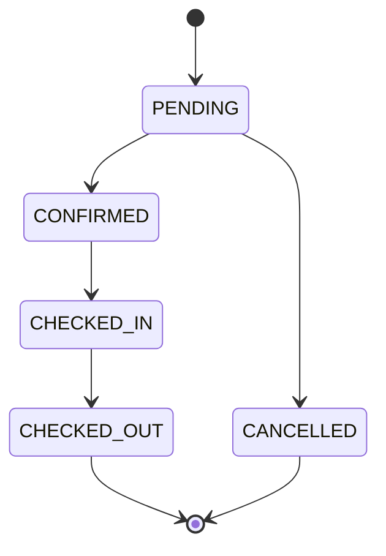
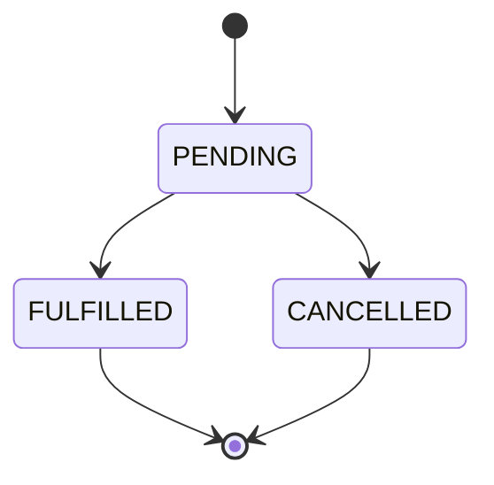
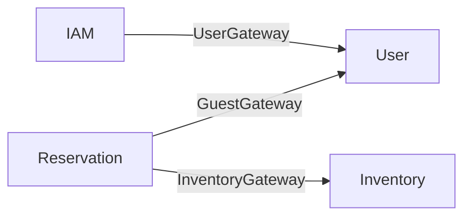

# Event Storming — GuestHub

> Color map based on Event Storming notation.
>
> Reference: [Remote Event Storming Workshop — DDD Practitioners](https://ddd-practitioners.com/2023/03/20/remote-eventstorming-workshop/)

| Color | Element | Role |
|-------|---------|------|
| 🟧 Orange | **Event** | Something that happened in the domain (past tense) |
| 🟦 Blue | **Command** | Intent to cause an event |
| 🟨 Yellow | **Actor** | Who triggers the command |
| 🟪 Purple | **Policy** | Reactive rule ("whenever X, then Y") |
| 🟩 Green | **Read Model** | Data projection for decision-making |
| 🟥 Red | **Test** | Acceptance criteria |
| ⬜ Gray | **Question** | Doubts or uncertainties |
| ◼️ Dark | **Invariant** | Rules that can never be violated |

---

## Bounded Context: IAM (Identity & Access Management)

### Flow: Actor Registration (Guest Self-Registration)

🟨 **Actor:** Visitor (anonymous user)

🟩 **Read Model:** Registration form (name, email, password, phone, document)

🟦 **Command:** Register Actor
> `accountName, name, email, password, phone, document`

◼️ **Invariant:** Email must be unique across the system
◼️ **Invariant:** Document must be unique across the system
◼️ **Invariant:** Password must be valid (hashed via bcrypt)

🟧 **Event:** Account Created
> `accountId, name`

🟧 **Event:** Actor Registered
> `actorId, accountId, email, type=GUEST`

🟪 **Policy:** Whenever Actor Registered (type=GUEST), then Create User
> Integration via UserGateway

🟧 **Event:** User Created
> `userId, email, loyaltyTier=BRONZE`

🟪 **Policy:** Whenever User Created, then Link Actor to User
> `Actor.userId = user.id`

---

### Flow: Hotel Owner Registration

🟨 **Actor:** Visitor (anonymous user)

🟩 **Read Model:** Owner registration form (name, email, password, phone, document)

🟦 **Command:** Register Hotel Owner
> `name, email, password, phone, document`

◼️ **Invariant:** Email must be unique across the system

🟧 **Event:** Account Created
> `accountId, name`

🟧 **Event:** Actor Registered
> `actorId, accountId, email, type=OWNER`

🟪 **Policy:** Whenever Actor Registered (type=OWNER), then Create User (no loyalty tier)
> Integration via UserGateway (loyaltyTier=null)

🟧 **Event:** User Created
> `userId, email, loyaltyTier=null`

> Hotel creation is a separate step done after login inside the dashboard.

---

### Flow: Authentication (Login)

🟨 **Actor:** Visitor (anonymous user)

🟩 **Read Model:** Login form (email, password)

🟦 **Command:** Authenticate Actor
> `email, password`

◼️ **Invariant:** Email must exist in the system
◼️ **Invariant:** Password must match the stored hash

🟧 **Event:** Actor Authenticated
> `actorId, token (Sanctum)`

🟥 **Test:** Login with valid credentials returns token
🟥 **Test:** Login with invalid credentials returns 401 error

---

### Flow: Logout

🟨 **Actor:** Guest | Owner | SuperAdmin

🟦 **Command:** Revoke Token

🟧 **Event:** Token Revoked
> `actorId`

---

### ⬜ Questions — IAM

- How does password recovery work?
- Is there an email verification flow?
- Can Owners be created via API or only via seeder/superadmin?

---

## Bounded Context: User (User Management)

### Flow: User Creation (via owner/superadmin API)

🟨 **Actor:** Owner | SuperAdmin

🟩 **Read Model:** Existing user list

🟦 **Command:** Create User
> `fullName, email, phone, document, loyaltyTier?`

◼️ **Invariant:** Document must be unique

🟧 **Event:** User Created
> `userId, email, loyaltyTier=BRONZE (or null for owners)`

---

### Flow: User Update

🟨 **Actor:** Guest (own profile) | Owner | SuperAdmin

🟩 **Read Model:** User Data (name, email, phone, loyalty tier, preferences)

🟦 **Command:** Update User
> `userId, fullName?, email?, phone?, loyaltyTier?, preferences?`

◼️ **Invariant:** Guest can only edit their own profile (except owner/superadmin)

🟧 **Event:** User Contact Info Updated
> `userId`

🟧 **Event:** User Loyalty Tier Changed *(if tier changed)*
> `userId, tier (BRONZE | SILVER | GOLD | PLATINUM)`

---

### Read Models — User

🟩 **User List** *(paginated, owner/superadmin only)*
> `fullName, email, phone, document, loyaltyTier`

🟩 **User Stats**
> count by loyalty tier (guests only, owners excluded)

🟩 **User Detail**
> `fullName, email, phone, document, loyaltyTier, preferences`

---

### ⬜ Questions — User

- Is there a history of loyalty tier changes?
- Are preferences free-text or from a predefined catalog?
- What is the business rule for loyalty tier upgrade/downgrade?

---

## Bounded Context: Inventory (Room Management)

### Flow: Room Creation

🟨 **Actor:** Owner | SuperAdmin

🟦 **Command:** Create Room
> `number, type (SINGLE|DOUBLE|SUITE), floor, capacity, pricePerNight, amenities[]`

◼️ **Invariant:** Room number must be unique

🟧 **Event:** Room Created
> `roomId, number, type, status=AVAILABLE`

---

### Flow: Room Update

🟨 **Actor:** Owner | SuperAdmin

🟩 **Read Model:** Room Detail (number, type, floor, capacity, price, amenities, status)

🟦 **Command:** Update Room
> `roomId, pricePerNight?, amenities?`

🟧 **Event:** Room Updated
> `roomId`

---

### Flow: Room Status Change

🟨 **Actor:** Owner | SuperAdmin

🟩 **Read Model:** Room Detail (current status)

🟦 **Command:** Change Room Status
> `roomId, newStatus`

◼️ **Invariant:** Room state machine

| From | To | Condition |
|------|----|-----------|
| AVAILABLE | OCCUPIED | only via check-in |
| OCCUPIED | AVAILABLE | only via check-out/release |
| AVAILABLE / MAINTENANCE / OUT_OF_ORDER | MAINTENANCE | — |
| AVAILABLE / MAINTENANCE / OUT_OF_ORDER | OUT_OF_ORDER | — |
| MAINTENANCE / OUT_OF_ORDER | AVAILABLE | — |
| OCCUPIED | MAINTENANCE / OUT_OF_ORDER | **FORBIDDEN** |

🟧 **Event:** Room Status Changed
> `roomId, oldStatus, newStatus`

---

### Read Models — Inventory

🟩 **Room List** *(paginated, owner/superadmin only)*
> `number, type, floor, capacity, pricePerNight, status, amenities`

🟩 **Room Stats**
> count by type (SINGLE, DOUBLE, SUITE) and by status (AVAILABLE, OCCUPIED, MAINTENANCE, OUT_OF_ORDER)

🟩 **Room Availability** *(used by Reservation BC)*
> `type, period, available count, price`

---

### ⬜ Questions — Inventory

- Is there a maintenance history for rooms?
- Are amenities free-text or from a catalog?
- Does the nightly rate vary by season?

---

## Bounded Context: Reservation (Reservation Management)

### Flow: Reservation Creation

🟨 **Actor:** Guest | Owner | SuperAdmin

🟩 **Read Model:** Room Availability (type, period, availability)
🟩 **Read Model:** User Data (loyalty tier -> VIP status)

🟦 **Command:** Create Reservation
> `guestId, checkIn, checkOut, roomType (SINGLE|DOUBLE|SUITE)`

◼️ **Invariant:** Check-in cannot be in the past
◼️ **Invariant:** Minimum stay: 1 night
◼️ **Invariant:** Maximum stay: 365 nights
◼️ **Invariant:** Check-out must be after check-in
◼️ **Invariant:** VIP guest (PLATINUM): can book up to 90 days in advance
◼️ **Invariant:** Regular guest: can book up to 60 days in advance
◼️ **Invariant:** Rooms of the requested type must be available for the period
◼️ **Invariant:** No overlapping reservations on the same room

🟧 **Event:** Reservation Created
> `reservationId, guestId, roomType, period, status=PENDING`

---

### Flow: Reservation Confirmation

🟨 **Actor:** Owner | SuperAdmin

🟩 **Read Model:** Reservation Detail (current status, user data)

🟦 **Command:** Confirm Reservation
> `reservationId`

◼️ **Invariant:** Reservation must be in PENDING status

🟧 **Event:** Reservation Confirmed
> `reservationId, confirmedAt`

---

### Flow: Check-In

🟨 **Actor:** Owner | SuperAdmin

🟩 **Read Model:** Reservation Detail (status, roomType)
🟩 **Read Model:** Room Availability (available rooms of type)

🟦 **Command:** Check In Guest
> `reservationId, roomNumber`

◼️ **Invariant:** Reservation must be in CONFIRMED status
◼️ **Invariant:** Room must be AVAILABLE

🟧 **Event:** Guest Checked In
> `reservationId, roomNumber, checkedInAt`

🟪 **Policy:** Whenever Guest Checked In, then Occupy Room
> `Room.status = OCCUPIED`

🟧 **Event:** Room Status Changed
> `roomId, AVAILABLE -> OCCUPIED`

---

### Flow: Check-Out

🟨 **Actor:** Owner | SuperAdmin

🟩 **Read Model:** Reservation Detail (status, assigned room)

🟦 **Command:** Check Out Guest
> `reservationId`

◼️ **Invariant:** Reservation must be in CHECKED_IN status

🟧 **Event:** Guest Checked Out
> `reservationId, checkedOutAt`

🟪 **Policy:** Whenever Guest Checked Out, then Release Room
> `Room.status = AVAILABLE`

🟧 **Event:** Room Status Changed
> `roomId, OCCUPIED -> AVAILABLE`

---

### Flow: Reservation Cancellation

🟨 **Actor:** Guest (own reservation) | Owner | SuperAdmin

🟩 **Read Model:** Reservation Detail (current status)

🟦 **Command:** Cancel Reservation
> `reservationId, reason`

◼️ **Invariant:** Reservation must be in PENDING or CONFIRMED status
◼️ **Invariant:** Cannot cancel if already CHECKED_IN, CHECKED_OUT, or CANCELLED

🟧 **Event:** Reservation Cancelled
> `reservationId, reason, cancelledAt`

---

### Flow: Special Requests

🟨 **Actor:** Guest (own reservation) | Owner | SuperAdmin

🟩 **Read Model:** Reservation Detail (status, existing special requests)

🟦 **Command:** Add Special Request
> `reservationId, requestType, description`
> requestType: `EARLY_CHECK_IN | LATE_CHECK_OUT | EXTRA_BED | DIETARY_RESTRICTION | SPECIAL_OCCASION | OTHER`

◼️ **Invariant:** Maximum of 5 special requests per reservation
◼️ **Invariant:** Cannot add if reservation is CANCELLED or CHECKED_OUT

🟧 **Event:** Special Request Added
> `reservationId, requestId, type, status=PENDING`

---

🟨 **Actor:** Owner | SuperAdmin

🟦 **Command:** Fulfill Special Request
> `reservationId, requestId`

🟧 **Event:** Special Request Fulfilled
> `reservationId, requestId, fulfilledAt`

---

### State Machine — Reservation

### State Machine — Special Request

---

### Read Models — Reservation

🟩 **Reservation List** *(paginated)*
> Filterable by: `status, roomType, guestId`
> Data: `id, guest, period, roomType, status, assignedRoom`

🟩 **Reservation Detail**
> `reservationId, guest (name, email, phone, isVip), period, roomType, assignedRoomNumber, status, specialRequests[], timestamps (created, confirmed, checkedIn, checkedOut, cancelled)`

🟩 **Reservation Stats**
> count by status, count by roomType, today's check-ins, today's check-outs

---

### ⬜ Questions — Reservation

- Is there billing/payment associated with reservations?
- Is there a cancellation policy (fees, deadlines)?
- Are notifications sent to guests on status changes?
- How does overbooking work? Is it allowed?

---

## Bounded Context Integration (Context Map)

### Integration Patterns

| Source | Target | Gateway | Operation |
|--------|---------|---------|----------|
| IAM | User | UserGateway | Create user during actor registration |
| Reservation | User | GuestGateway | Fetch user info (name, VIP status) |
| Reservation | Inventory | InventoryGateway | Check room availability |
| Reservation | Inventory | InventoryGateway | Occupy/release room (check-in/check-out) |

---

## Actors (System Types)

🟨 **SuperAdmin**
> System administrator. No associated account. Full access to all bounded contexts. Can impersonate hotel owners.

🟨 **Owner**
> Hotel owner / property manager. Associated with an Account (tenant) and Hotel. Can: manage rooms, confirm/check-in/check-out reservations, manage users.

🟨 **Guest**
> Hotel guest. Associated with an Account + User entity (with loyalty tier). Can: view/create/cancel own reservations, add special requests, edit own profile via portal.

---

## Consolidated Timeline (Main Flow)

