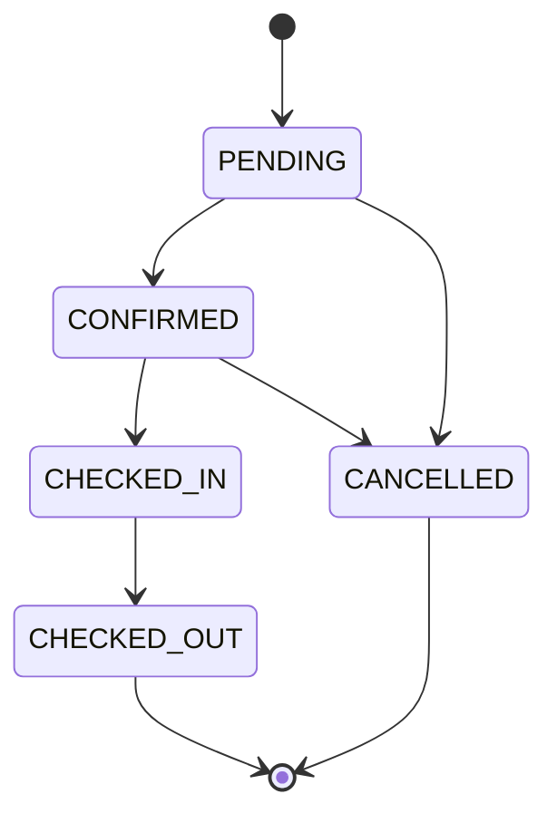
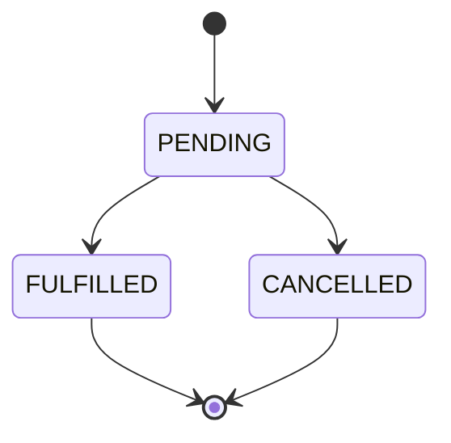
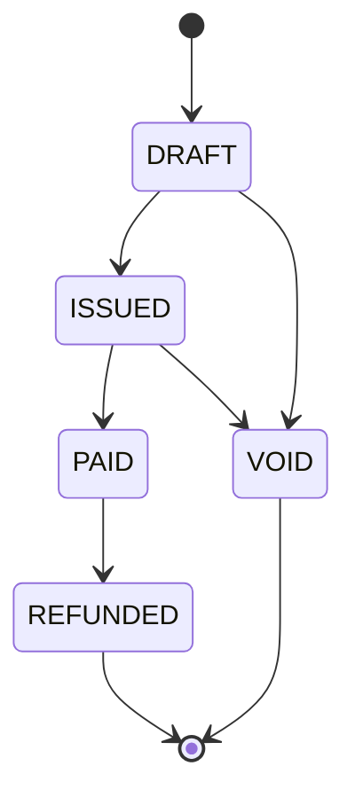
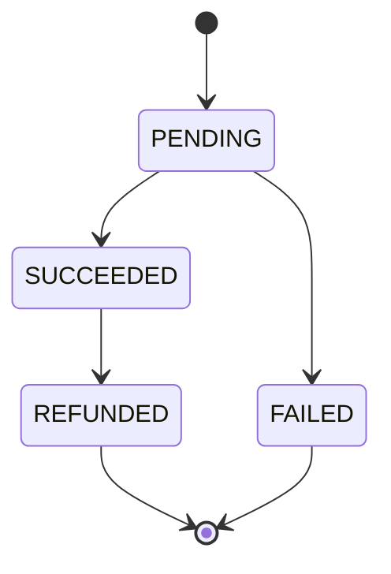
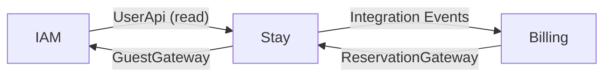
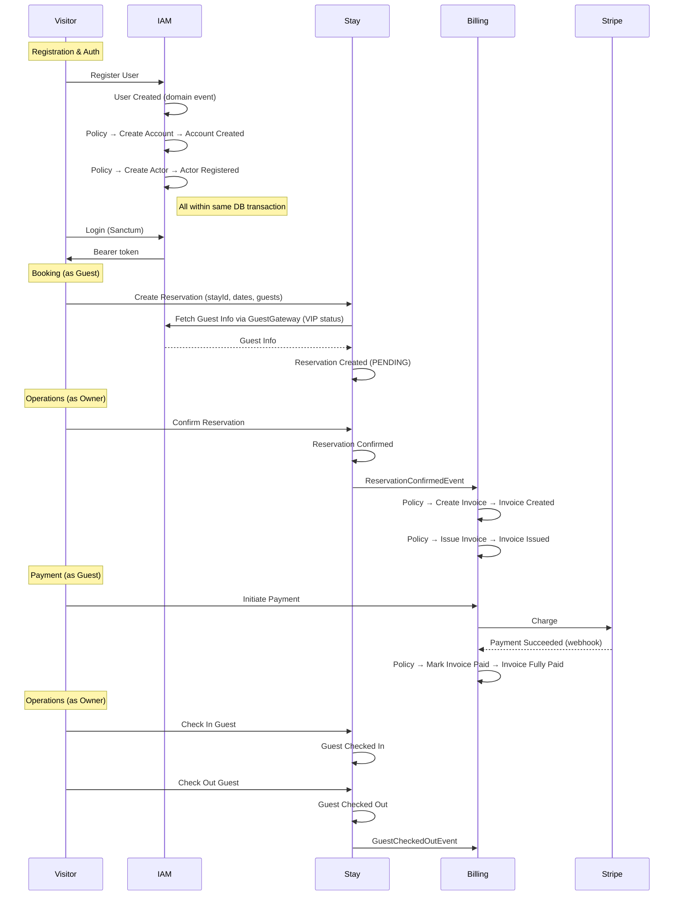

# Event Storming — GuestHub

> Color map based on Event Storming notation.
>
> Reference: [Remote Event Storming Workshop — DDD Practitioners](https://ddd-practitioners.com/2023/03/20/remote-eventstorming-workshop/)

| Color | Element | Role |
|-------|---------|------|
| 🟧 Orange | **Event** | Something that happened in the domain (past tense) |
| 🟦 Blue | **Command** | Intent to cause an event |
| 🟨 Yellow | **Actor** | Who triggers the command |
| 🟪 Purple | **Policy** | Reactive rule ("whenever X, then Y") — acts as an **automated actor** that issues a command in response to an event |
| 🟩 Green | **Read Model** | Data projection for decision-making |
| 🩷 Pink | **External System** | Third-party / outside-the-domain system that produces or consumes events |
| ◼️ Dark | **Invariant** | Rules that can never be violated |

> **Policies as actors:** every 🟪 Policy in this document reacts to an 🟧 Event by issuing a 🟦 Command — it is the automated counterpart of a 🟨 human Actor. Each policy below is followed by the explicit command it dispatches and the event that command produces.

---

## Bounded Context: IAM (Identity & Access Management)

### Flow: Guest Registration

🟨 **Actor:** Visitor (anonymous user)

🟩 **Read Model:** Registration form (name, email, password, phone, document)

🟦 **Command:** Register User
> `name, email, password, phone, document`

◼️ **Invariant:** Email must be unique (User aggregate, via `UserEmailUniquenessChecker`)
◼️ **Invariant:** Password must be valid (hashed via bcrypt)

🟧 **Event:** User Created
> `userId, name, email, hashedPassword, actorType=guest, accountName, accountSlug`
> Recorded inside `User::create()` aggregate factory

🟪 **Policy (automated actor):** Whenever User Created → issue Create Account
> Synchronous listener inside same DB transaction (via `TransactionManager`)

🟦 **Command:** Create Account
> `accountId, name, slug`

◼️ **Invariant:** Slug must be unique

🟧 **Event:** Account Created
> `accountId, name, slug`

🟪 **Policy (automated actor):** Whenever Account Created → issue Create Actor
> Synchronous listener inside same DB transaction; resolves user numeric ID + actor type

🟦 **Command:** Create Actor
> `actorId, accountId, userId, typeId, name, email, hashedPassword`

◼️ **Invariant:** Email must be unique (Actor aggregate, via `EmailUniquenessChecker`)

🟧 **Event:** Actor Registered
> `actorId, accountId, email, type=GUEST`

---

### Flow: Hotel Owner Registration

🟨 **Actor:** Visitor (anonymous user)

🟩 **Read Model:** Owner registration form (name, email, password, phone, document)

🟦 **Command:** Register Hotel Owner
> `name, email, password, phone, document`

◼️ **Invariant:** Email must be unique (User aggregate, via `UserEmailUniquenessChecker`)

🟧 **Event:** User Created
> `userId, name, email, hashedPassword, actorType=owner, accountName, accountSlug`

🟪 **Policy (automated actor):** Whenever User Created → issue Create Account
> Same synchronous chain as guest registration (loyaltyTier=null for owners)

🟦 **Command:** Create Account
> `accountId, name, slug`

🟧 **Event:** Account Created
> `accountId, name, slug`

🟪 **Policy (automated actor):** Whenever Account Created → issue Create Actor

🟦 **Command:** Create Actor
> `actorId, accountId, userId, typeId, name, email, hashedPassword`

🟧 **Event:** Actor Registered
> `actorId, accountId, email, type=OWNER`

> Hotel creation is a separate step done after login inside the dashboard.

---

### Flow: Authentication (Login)

🟨 **Actor:** Visitor (anonymous user)

🟩 **Read Model:** Login form (email, password)

◼️ **Invariant:** Email must exist in the system
◼️ **Invariant:** Password must match the stored hash

> Login is handled by Laravel Sanctum (`Auth::attempt` + bearer token issuance). No domain command or event is currently recorded.

---

### Flow: Logout

🟨 **Actor:** Guest | Owner | SuperAdmin

> Sanctum revokes the bearer token on logout. No domain command or event is currently recorded.

---

## Bounded Context: IAM — User Management

> User management is part of the IAM bounded context (not a separate BC).

### Flow: User Update

🟨 **Actor:** Guest (own profile) | Owner | SuperAdmin

🟩 **Read Model:** User Data (name, email, phone, loyalty tier, preferences)

🟦 **Command:** Update User
> `userId, fullName?, email?, phone?, loyaltyTier?, preferences?`

◼️ **Invariant:** Guest can only edit their own profile (except owner/superadmin)

🟧 **Event:** User Contact Info Updated
> `userId`

🟧 **Event:** User Loyalty Tier Changed *(if tier changed)*
> `userId, tier (BRONZE | SILVER | GOLD | PLATINUM)`

---

### Read Models — User

🟩 **User List** *(paginated, owner/superadmin only)*
> `fullName, email, phone, document, loyaltyTier`

🟩 **User Stats**
> count by loyalty tier (guests only, owners excluded)

🟩 **User Detail**
> `fullName, email, phone, document, loyaltyTier, preferences`

---

## Bounded Context: Stay (Property & Reservation Management)

### Flow: Stay Creation

🟨 **Actor:** Owner | SuperAdmin

🟦 **Command:** Create Stay
> `accountId, name, slug, type, category, pricePerNight, capacity, description?, address?, contactEmail?, contactPhone?, amenities[]`

◼️ **Invariant:** Slug must be unique within the account
◼️ **Invariant:** Type must be ROOM or ENTIRE_SPACE
◼️ **Invariant:** Category must be HOTEL_ROOM, HOUSE, or APARTMENT

🟧 **Event:** Stay Created
> `stayId, name, type, category, status=active`

---

### Flow: Reservation Creation

🟨 **Actor:** Guest | Owner | SuperAdmin

🟩 **Read Model:** Stay Detail (capacity, price, availability)
🟩 **Read Model:** User Data (loyalty tier → VIP status)

🟦 **Command:** Create Reservation
> `guestId, stayId, checkIn, checkOut, adults?, children?, babies?, pets?`

◼️ **Invariant:** Check-in cannot be in the past
◼️ **Invariant:** Minimum stay: 1 night
◼️ **Invariant:** Maximum stay: 365 nights
◼️ **Invariant:** Check-out must be after check-in
◼️ **Invariant:** VIP guest (PLATINUM): can book up to 90 days in advance
◼️ **Invariant:** Regular guest: can book up to 60 days in advance
◼️ **Invariant:** Adults must be at least 1

🟧 **Event:** Reservation Created
> `reservationId, guestId, stayId, period, guests={adults, children, babies, pets}, status=PENDING`

---

### Flow: Reservation Confirmation

🟨 **Actor:** Owner | SuperAdmin

🟩 **Read Model:** Reservation Detail (current status, user data)

🟦 **Command:** Confirm Reservation
> `reservationId`

◼️ **Invariant:** Reservation must be in PENDING status

🟧 **Event:** Reservation Confirmed
> `reservationId, confirmedAt`

🟪 **Policy (automated actor):** Whenever Reservation Confirmed → issue Create Invoice for Reservation (cross-BC, Billing)

🟦 **Command (Billing):** Create Invoice for Reservation
> `reservationId, guestId, accountId, stayName, pricePerNight, nights`

🟧 **Event (Billing):** Invoice Created
> `invoiceId, reservationId, status=DRAFT`

🟪 **Policy (automated actor):** Whenever Invoice Created → issue Issue Invoice (Billing-internal)

🟦 **Command (Billing):** Issue Invoice
> `invoiceId`

🟧 **Event (Billing):** Invoice Issued
> `invoiceId, status=ISSUED`

---

### Flow: Check-In

🟨 **Actor:** Owner | SuperAdmin

🟩 **Read Model:** Reservation Detail (status)

🟦 **Command:** Check In Guest
> `reservationId`

◼️ **Invariant:** Reservation must be in CONFIRMED status

🟧 **Event:** Guest Checked In
> `reservationId, checkedInAt`

---

### Flow: Check-Out

🟨 **Actor:** Owner | SuperAdmin

🟩 **Read Model:** Reservation Detail (status)

🟦 **Command:** Check Out Guest
> `reservationId`

◼️ **Invariant:** Reservation must be in CHECKED_IN status

🟧 **Event:** Guest Checked Out
> `reservationId, checkedOutAt`

---

### Flow: Reservation Cancellation

🟨 **Actor:** Guest (own reservation) | Owner | SuperAdmin

🟩 **Read Model:** Reservation Detail (current status)

🟦 **Command:** Cancel Reservation
> `reservationId, reason`

◼️ **Invariant:** Reservation must be in PENDING or CONFIRMED status
◼️ **Invariant:** Cannot cancel if already CHECKED_IN, CHECKED_OUT, or CANCELLED

🟧 **Event:** Reservation Cancelled
> `reservationId, reason, cancelledAt`

🟪 **Policy (automated actor):** Whenever Reservation Cancelled → issue Void Invoice (cross-BC, Billing)

🟦 **Command (Billing):** Void Invoice
> `invoiceId, reason`

🟧 **Event (Billing):** Invoice Voided
> `invoiceId, reason`

---

### Flow: Special Requests

🟨 **Actor:** Guest (own reservation) | Owner | SuperAdmin

🟩 **Read Model:** Reservation Detail (status, existing special requests)

🟦 **Command:** Add Special Request
> `reservationId, requestType, description`
> requestType: `EARLY_CHECK_IN | LATE_CHECK_OUT | EXTRA_BED | DIETARY_RESTRICTION | SPECIAL_OCCASION | OTHER`

◼️ **Invariant:** Maximum of 5 special requests per reservation
◼️ **Invariant:** Cannot add if reservation is CANCELLED or CHECKED_OUT

🟧 **Event:** Special Request Added
> `reservationId, requestId, type, status=PENDING`

---

🟨 **Actor:** Owner | SuperAdmin

🟦 **Command:** Fulfill Special Request
> `reservationId, requestId`

🟧 **Event:** Special Request Fulfilled
> `reservationId, requestId, fulfilledAt`

---

### State Machine — Reservation

```mermaid
stateDiagram-v2
    [*] --> PENDING
    PENDING --> CONFIRMED
    PENDING --> CANCELLED
    CONFIRMED --> CHECKED_IN
    CONFIRMED --> CANCELLED
    CHECKED_IN --> CHECKED_OUT
    CHECKED_OUT --> [*]
    CANCELLED --> [*]
```

### State Machine — Special Request

```mermaid
stateDiagram-v2
    [*] --> PENDING
    PENDING --> FULFILLED
    PENDING --> CANCELLED
    FULFILLED --> [*]
    CANCELLED --> [*]
```

---

### Read Models — Stay & Reservation

🟩 **Stay List** *(paginated, portal/public)*
> `name, slug, type, category, address, pricePerNight, capacity, coverImageUrl`
> Filterable by: `search query (name/address/description), guest counts (adults+children vs capacity)`

🟩 **Stay Detail**
> `name, slug, type, category, description, address, pricePerNight, capacity, amenities[], contactEmail, contactPhone, coverImageUrl, galleryImages[]`

🟩 **Reservation List** *(paginated)*
> Filterable by: `status, guestId`
> Data: `id, guest, stay, period, guests (adults/children/babies/pets), status, timestamps`

🟩 **Reservation Detail**
> `reservationId, guest (name, email, phone, isVip), stay (name, slug, address), period (checkIn, checkOut, nights), guests (adults, children, babies, pets), status, specialRequests[], freeCancellationUntil, cancellationReason, timestamps`

---

## Bounded Context: Billing (Invoice & Payment Management)

### Flow: Invoice Creation (via integration event)

🟪 **Policy (automated actor):** Whenever Reservation Confirmed (Stay BC integration event) → issue Create Invoice for Reservation

🟦 **Command:** Create Invoice for Reservation
> `reservationId, guestId, accountId, stayName, pricePerNight, nights`

🟧 **Event:** Invoice Created
> `invoiceId, reservationId, status=DRAFT`

🟪 **Policy (automated actor):** Whenever Invoice Created → issue Issue Invoice

🟦 **Command:** Issue Invoice
> `invoiceId`

🟧 **Event:** Invoice Issued
> `invoiceId, status=ISSUED`

---

### Flow: Payment

🟨 **Actor:** Guest (via portal checkout)

🟩 **Read Model:** Invoice Detail (status, lineItems, total)

🟦 **Command:** Initiate Payment
> `invoiceId`

🟧 **Event:** Payment Recorded
> `invoiceId, paymentId, amount, method=CARD, status=PENDING`

🩷 **External System:** Stripe — processes the charge and signals success/failure via webhook

🟧 **Event:** Payment Succeeded
> `paymentId, invoiceId, amount`

🟪 **Policy (automated actor):** Whenever Payment Succeeded (Stripe webhook or simulated) → issue Mark Invoice Paid

🟦 **Command:** Mark Invoice Paid
> `invoiceId, paymentId, paidAt`

🟧 **Event:** Invoice Fully Paid
> `invoiceId, reservationId, paidAt`

---

### Flow: Invoice Void (via cancellation)

🟪 **Policy (automated actor):** Whenever Reservation Cancelled (Stay BC integration event) → issue Void Invoice

🟦 **Command:** Void Invoice
> `invoiceId, reason`

◼️ **Invariant:** Invoice must be in DRAFT or ISSUED status

🟧 **Event:** Invoice Voided
> `invoiceId, reason`

---

### State Machine — Invoice

```mermaid
stateDiagram-v2
    [*] --> DRAFT
    DRAFT --> ISSUED
    DRAFT --> VOID
    ISSUED --> PAID
    ISSUED --> VOID
    PAID --> REFUNDED
    REFUNDED --> [*]
    VOID --> [*]
```

### State Machine — Payment

```mermaid
stateDiagram-v2
    [*] --> PENDING
    PENDING --> SUCCEEDED
    PENDING --> FAILED
    SUCCEEDED --> REFUNDED
    REFUNDED --> [*]
    FAILED --> [*]
```

---

### Read Models — Billing

🟩 **Invoice List** *(paginated, guest or owner)*
> `invoiceNumber, status, totalCents, createdAt, issuedAt, paidAt`

🟩 **Invoice Detail**
> `invoiceNumber, status, lineItems[], subtotalCents, taxCents, totalCents, payments[], timestamps`

---

## Bounded Context Integration (Context Map)

```mermaid
graph LR
    IAM -- "UserApi (read)" --> Stay
    Stay -- GuestGateway --> IAM
    Billing -- ReservationGateway --> Stay
    Stay -- "Integration Events" --> Billing
```

### Integration Patterns

| Source | Target | Pattern | Operation |
|--------|---------|---------|----------|
| IAM | IAM (internal) | Domain Events / Policies | `UserCreated` → Policy → `Create Account` → `AccountCreated` → Policy → `Create Actor` → `ActorRegistered` (all synchronous, same transaction) |
| Stay | IAM | GuestGateway / UserApi | Fetch guest info (name, email, VIP status) for integration events |
| Stay | Billing | Integration Events | ReservationConfirmed, GuestCheckedOut, ReservationCancelled |
| Billing | Stay | ReservationGateway | Fetch reservation and stay data for invoice creation |
| Billing | Stripe | PaymentGateway | Create payment intents, process webhooks |

---

## Actors (System Types)

🟨 **SuperAdmin**
> System administrator. No associated account. Full access to all bounded contexts. Can impersonate hotel owners.

🟨 **Owner**
> Property owner / manager. Associated with an Account (tenant). Can: manage stays, confirm/check-in/check-out reservations, manage users/guests, view invoices.

🟨 **Guest**
> Guest user. Associated with an Account + User entity (with loyalty tier). Can: browse stays, create/cancel own reservations, add special requests, edit own profile, view and pay invoices via portal.

---

## Consolidated Timeline (Main Flow)

```mermaid
sequenceDiagram
    participant V as Visitor
    participant IAM
    participant S as Stay
    participant B as Billing
    participant Stripe

    Note over V: Registration & Auth
    V->>IAM: Register User
    IAM->>IAM: User Created (domain event)
    IAM->>IAM: Policy → Create Account → Account Created
    IAM->>IAM: Policy → Create Actor → Actor Registered
    Note right of IAM: All within same DB transaction
    V->>IAM: Login (Sanctum)
    IAM->>V: Bearer token

    Note over V: Booking (as Guest)
    V->>S: Create Reservation (stayId, dates, guests)
    S->>IAM: Fetch Guest Info via GuestGateway (VIP status)
    IAM-->>S: Guest Info
    S->>S: Reservation Created (PENDING)

    Note over V: Operations (as Owner)
    V->>S: Confirm Reservation
    S->>S: Reservation Confirmed
    S->>B: ReservationConfirmedEvent
    B->>B: Policy → Create Invoice → Invoice Created
    B->>B: Policy → Issue Invoice → Invoice Issued

    Note over V: Payment (as Guest)
    V->>B: Initiate Payment
    B->>Stripe: Charge
    Stripe-->>B: Payment Succeeded (webhook)
    B->>B: Policy → Mark Invoice Paid → Invoice Fully Paid

    Note over V: Operations (as Owner)
    V->>S: Check In Guest
    S->>S: Guest Checked In

    V->>S: Check Out Guest
    S->>S: Guest Checked Out
    S->>B: GuestCheckedOutEvent
```
